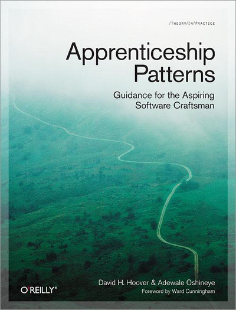

<h1>Apprenticeship Patterns</h1>

Recommended reading schedule: 2 chapters per week 

<h3>Schedule</h3>
<h6>Week 1</h6>
0. Introduction
1. Emptying the Cup 
<h6>Week 2</h6>
2. Walking the Long Road
3. Accurate Self-Assessment
<h6>Week 3</h6>
4. Perpetual Learning
5. Construct Your Curriculum
<h6>Week 4</h6>
6. Conclusion
7. Index of Resources 
